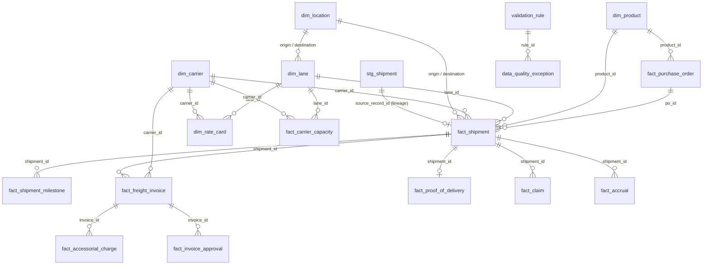

# Project Architecture — Solar Logistics Control Tower

## Overview

A relational analytics environment simulating data flows across ERP, TMS, WMS,
carrier, customs, and freight-settlement systems for **SunGrid Energy Solutions**,
a fictional solar-panel, inverter, and energy-storage manufacturer.

```
┌────────────────────────────────────────────────────────────────────────────┐
│  PUBLIC SOURCE                                                             │
│  USAID SCMS Delivery History Dataset (10,324 shipment line items)          │
│  checksum-verified download (sha256 pinned; portal offline since 2025)     │
└───────────────┬────────────────────────────────────────────────────────────┘
                │  src/download_data.py → src/profile_data.py
                ▼
┌────────────────────────────────────────────────────────────────────────────┐
│  STAGING (Phase 1)                                                         │
│  src/clean_shipments.py → stg_shipment (+ stg_rejected_record ledger)      │
│  · date parsing w/ sentinel handling      · mode normalization             │
│  · See DN/ASN cross-reference resolution  · solar catalog adaptation       │
│  · full lineage: source_record_id         · +10y reporting date shift      │
└───────────────┬────────────────────────────────────────────────────────────┘
                │  src/generate_master_data.py / generate_enterprise_data.py
                ▼                                            (Phase 2)
┌────────────────────────────────────────────────────────────────────────────┐
│  SIMULATED ENTERPRISE LAYER (Phase 2) — derived from staged real patterns  │
│  dim_carrier · dim_lane · dim_location · dim_product · dim_rate_card       │
│  fact_purchase_order · fact_shipment · fact_shipment_milestone             │
│  fact_freight_invoice · fact_accessorial_charge · fact_proof_of_delivery   │
│  fact_claim · fact_accrual · fact_carrier_capacity · fact_invoice_approval │
│  + controlled exception injection (config/exception_config.yaml, seeded)   │
└───────────────┬────────────────────────────────────────────────────────────┘
                │  sql/04..10 (Phase 3)
                ▼
┌────────────────────────────────────────────────────────────────────────────┐
│  ANALYTICS: data-quality rules · logistics KPIs (OTIF, GIT, transit,       │
│  freight spend) · freight-rating & audit · three-way match · accruals ·    │
│  carrier scorecard · root-cause case studies                               │
└───────────────┬────────────────────────────────────────────────────────────┘
                │  sql/11_power_bi_views.sql · src/export_reporting_tables.py
                ▼
┌────────────────────────────────────────────────────────────────────────────┐
│  REPORTING (Phase 4): Power BI views + DAX spec · Excel KPI pack · SOP     │
└────────────────────────────────────────────────────────────────────────────┘
```

## Data classification

Every table carries a `data_class` column (`PUBLIC` / `DERIVED` / `SIMULATED`)
and the column-level classification lives in
`documentation/source_to_target_mapping.xlsx`:

| Class | Meaning |
|---|---|
| PUBLIC | Value taken from the public USAID file (possibly parsed/cast) |
| DERIVED | Computed from public values by a documented deterministic rule |
| SIMULATED | Generated enterprise data (Phase 2), seeded and reproducible |

## Database

- **Primary:** PostgreSQL 16 (`docker compose up -d`), schema `sunlog`
- **Fallback:** SQLite (`DATABASE_URL` unset) — DDL adapted automatically by
  `src/load_database.py` (schema qualifiers stripped; types map to SQLite
  affinities)
- All DDL lives in `sql/` and is executed idempotently (`IF NOT EXISTS`,
  staging reload uses delete-and-append).

## Entity-relationship diagram



## Key Phase 1 design decisions (assumption log)

1. **Official portal offline.** `data.usaid.gov` was decommissioned in 2025.
   The file is acquired from public GitHub mirrors and rejected unless its
   SHA-256 equals the pinned value (originally cross-validated between two
   independent mirrors, one of them a Git-LFS object hash).
2. **Cross-reference resolution.** 2,445 rows carry
   `See DN-xxxx (ID#:yyyy)` / `See ASN-xxxx (ID#:yyyy)` instead of a numeric
   weight/freight value. These reference another row of the same file; the
   pipeline resolves them by ID lookup (one hop). Result: weight coverage
   61.7% → 84.2%, freight coverage 60.0% → 82.7%. Unresolvable references
   (referenced row is itself a sentinel) are flagged, not guessed.
3. **No ship-date column exists** in the source. `ship_date` will be derived
   in Phase 2 from mode-standard transit times and flagged `DERIVED`; it is
   deliberately absent from `stg_shipment`.
4. **Product adaptation is deterministic and disclosed.** Real shipment
   patterns are preserved; product identity is remapped
   (`ARV|Adult → SOLAR_MODULE`, `ARV|Pediatric → INVERTER`,
   `HRDT|HIV test → BATTERY_ESS`, remainder → `BOS_COMPONENT`) via
   `config/project_config.yaml`. Original product columns are retained
   (`*_raw`) for lineage.
5. **Reporting date shift.** Source deliveries span 2006-06..2015-09; a
   constant +10-year shift produces a modern reporting window
   (2016-06..2025-09) while preserving every interval and seasonal pattern.
   Both original and shifted dates are stored.
6. **Nothing is silently dropped.** Hard-rule failures go to
   `stg_rejected_record` with a reason. (The source file passes all hard
   rules: 0 rejects, 10,324/10,324 rows staged.)
7. **Late delivery is real, not injected.** OTIF pressure in this dataset is
   genuine; the Phase 2 exception injector deliberately excludes lateness.

## Phase 2 — enterprise simulation methodology

### Pipeline (`python src/run_phase2.py`)

```
stg_shipment (10,324, Phase 1)
   │  generate_master_data.py           → data/processed/clean/dim_*.csv
   │     locations (+xref) · products · suppliers · warehouses · carriers ·
   │     lanes (+rate) · rate cards ; writes interim/shipment_resolved.csv
   │  generate_enterprise_data.py       → data/processed/clean/fact_*.csv
   │     POs · shipments · milestones · invoices · lines · accessorials ·
   │     POD · claims · capacity · approvals · accruals ; rpt_* reports
   ▼
CLEAN BASELINE (ground truth) ──▶ validate_phase2.py (60 checks, 0 critical)
   │  inject_exceptions.py  (config/exception_config.yaml, seeded, disjoint)
   ▼
OPERATIONAL LAYER  data/processed/operational/*.csv  +  exception_manifest.csv
   │  load_phase2.py  (apply sql/20_phase2_enterprise_model.sql, load operational)
   ▼
sunlog.db / PostgreSQL  ──▶  Phase 3 analytics
```

### Clean-vs-exception storage strategy
- The **clean baseline** lives in `data/processed/clean/` (immutable ground
  truth) and is validated to zero critical failures before anything is injected.
- The **operational layer** (`data/processed/operational/`) is the clean
  baseline with deterministically injected exceptions; this is what loads into
  the canonical DB tables, because a real TMS/settlement database contains the
  errors that audit must catch.
- The **exception manifest** records every clean→injected change
  (`clean_value`, `injected_value`), so clean-vs-corrupted comparison needs no
  duplicate tables. A single documented FK relaxation applies only to the
  intentionally-corrupted operational load (SQLite doesn't enforce FKs;
  PostgreSQL uses `session_replication_role=replica` for that load).

### Key derivation rules (assumption log, continued)
8. **`data_class` is the provenance marker** (PUBLIC / DERIVED / SIMULATED) on
   every table — the project's single name for "source_type"; not duplicated.
9. **Deterministic everything.** IDs come from stable natural keys; every
   stochastic draw is seeded per-record (hash of seed+salt+key), so output is
   order-independent, reproducible, and idempotent.
10. **Ship dates are derived, and flagged.** The source has no departure
    timestamp. `planned_ship = planned_delivery − lane standard transit`;
    `actual_ship = actual_delivery − (standard ± seeded jitter)`;
    `booking = min(ship dates) − lead`. Real delivery dates are never
    overwritten. `ship_date_derived_flag = 1`.
11. **Transit standard is mode/region-based, not observed.** With no departure
    timestamp, true transit is unobservable; `rpt_lane_derivation` records the
    chosen standard, method (`MODE_REGION_STANDARD`), data sufficiency, and a
    real order-lead proxy — it never claims to have measured transit.
12. **Rate calibration.** `rate_per_kg` per mode ≈ observed median freight/kg
    (AIR 9.35, OCEAN 1.62, TRUCK 1.82, …); `rpt_rate_reconciliation` shows the
    all-mode expected/observed ratio ≈ 1.0.
13. **Goods-in-transit snapshot.** Shipments whose (shifted) delivery falls
    after `data_as_of_date` (2025-07-01) are treated as IN_TRANSIT (≈3%), giving
    Phase 3 a realistic GIT / open-accrual population.
14. **Nominal product units.** `unit_weight_kg`/`unit_value_usd` are the observed
    median pack weight/value from the source, representing pack/carton units —
    not full-panel physical specs. Shipment weights remain the real source
    values (imputed only where the source lacked them, flagged).

### Exception injection
- 19 configured types, rates in `config/exception_config.yaml`. Selection is
  deterministic and **disjoint** per pool (a record/column is touched by at most
  one type), so exceptions never silently overlap. Any type can be disabled from
  config. See `documentation/phase2_summary.md` for per-type expected vs actual
  counts.
- Minor, documented cross-pool interactions are possible and realistic (e.g. an
  invoice given a carrier mismatch whose shipment also had its carrier nulled);
  the manifest remains exact to the records changed.
